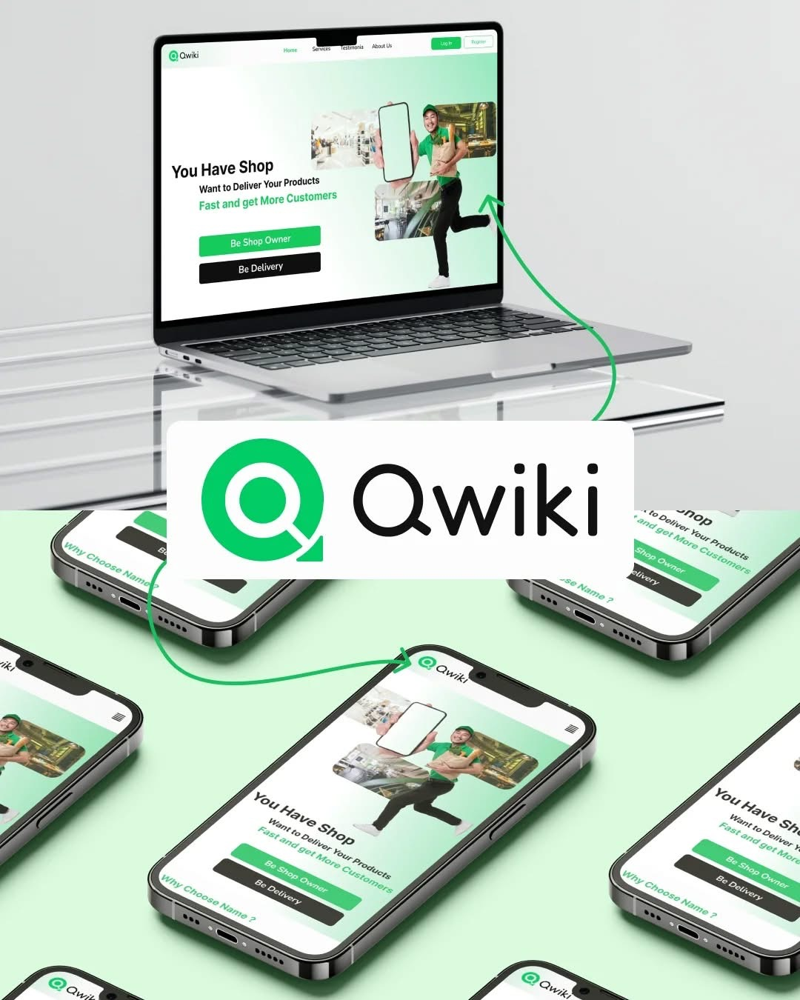
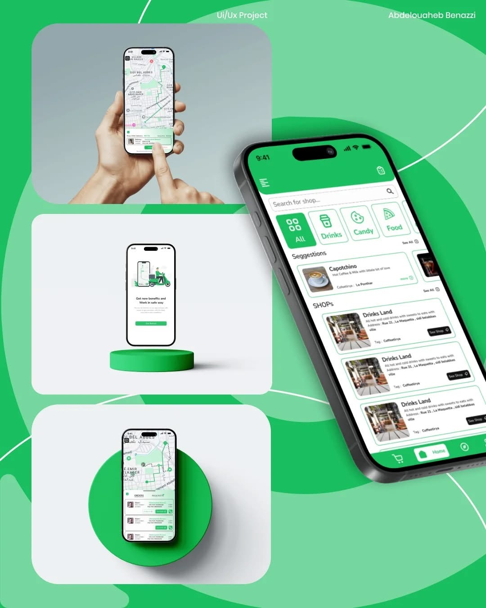

# Qwiki – Intelligent Delivery Platform (Flutter App)

Qwiki is a smart, scalable delivery solution designed to streamline last-mile logistics through real-time tracking, intelligent delivery assignment, and a smooth user experience.

This repository contains the **Flutter-based mobile frontend** of the Qwiki platform, developed as part of our 4th-year graduation project at the Higher School of Computer Science – Sidi Bel Abbès.

---

## 📸 Screenshots







---

## 🚀 Overview

Qwiki connects **clients**, **merchants**, and **delivery agents (livreurs)** through a unified and intuitive mobile experience:

- 📦 **Clients** can place and track orders in real-time.
- 🛒 **Merchants** can manage their product catalogs.
- 🚴 **Delivery agents** receive intelligent delivery assignments.

---

## 📱 Mobile App (Flutter)

This Flutter app offers a clean, responsive UI with real-time features including:

- Role-based login and navigation (Client, Merchant, Livreur)
- Order placement and management
- Live delivery tracking with Mapbox integration
- Notifications and status updates
- Smooth animations and intuitive UX

---

## 🌐 Full System Architecture

Qwiki is built using a microservices architecture, making it scalable, maintainable, and resilient. Here’s a summary of the full platform components:

### 🔧 Microservices (Backend)

| Service | Stack | Description |
|--------|-------|-------------|
| **User Management** | Spring Boot | JWT & OAuth-based role handling for Admins, Clients, Merchants, and Livreurs |
| **Product & Order** | Express.js | Catalog management and order handling (Express/Standard modes) |
| **Real-Time Tracking** | Express.js + Socket.io | Live tracking and delivery updates |
| **Optimization** | FastAPI | Assigns best delivery agent based on availability & distance |
| **Payment** | Express.js + Chargily | Secure payment integration |

---

### ☁️ Cloud-Native Deployment

- **Kubernetes (K8s)** for orchestration
- **MongoDB Atlas**, **MySQL** for data storage
- **Docker** for containerization
- **GitHub** for collaboration and CI/CD

---

## 🗺️ Tech Stack

- **Frontend:** Flutter (mobile), React.js (web)
- **Backend:** Spring Boot, Express.js, FastAPI
- **Database:** MongoDB Atlas, MySQL
- **Real-Time:** WebSockets, Socket.io
- **Maps & Routing:** Mapbox, GraphHopper
- **Deployment:** Docker, Kubernetes

---

## 🤝 Team

- 🎨 **Flutter Frontend:** [Issam Dine](https://linktr.ee/DineIssam)  
- 🔧 **Backend Services:** Seif Islem Benrabah, Abdelwaheb Benazzi, Kamil Kazi  
- 🧠 **Supervised by:** Dr. Abdelhamid Malki

---

## 🛠️ Getting Started

1. Clone the repository:
   ```bash
   git clone https://github.com/yourusername/qwiki-flutter.git
